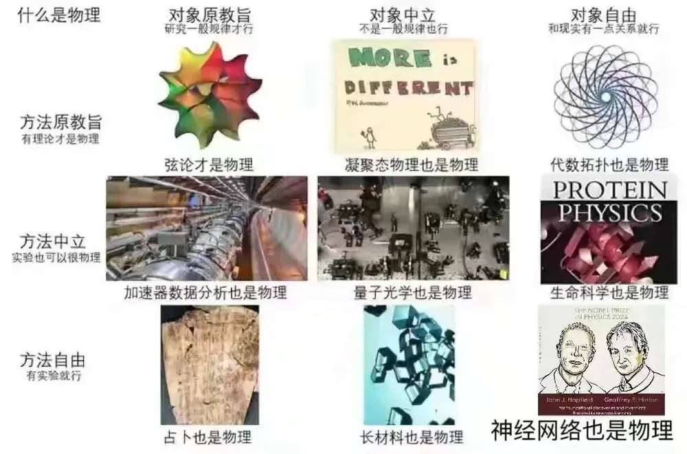
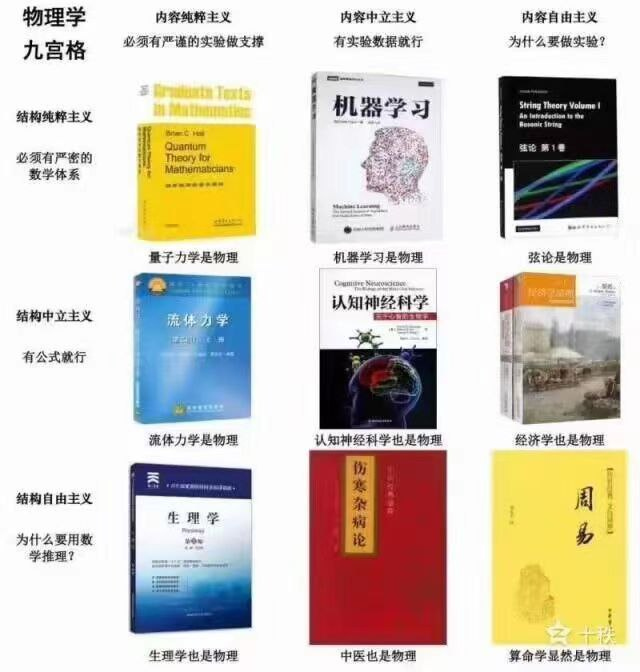

+++
title = "2024 诺贝尔物理学奖小记"
date = "2024-10-09T20:18:58+09:00"
draft = false
description = ""
[taxonomies]
tags = ["History"]
+++

杰弗里·辛顿出自书香世家, 他有一位堂姑, 叫琼·辛顿, 当然, 中国人应该更熟悉他的这位堂姑的中文名, 寒春

感觉像是唐纳德·特朗普的叔叔约翰·特朗普为中国核物理事业做出了贡献一样有着奇妙的联系

