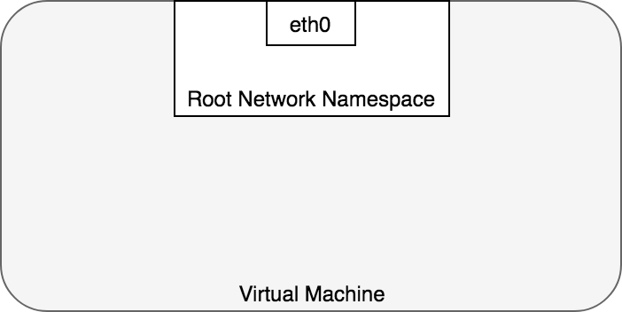
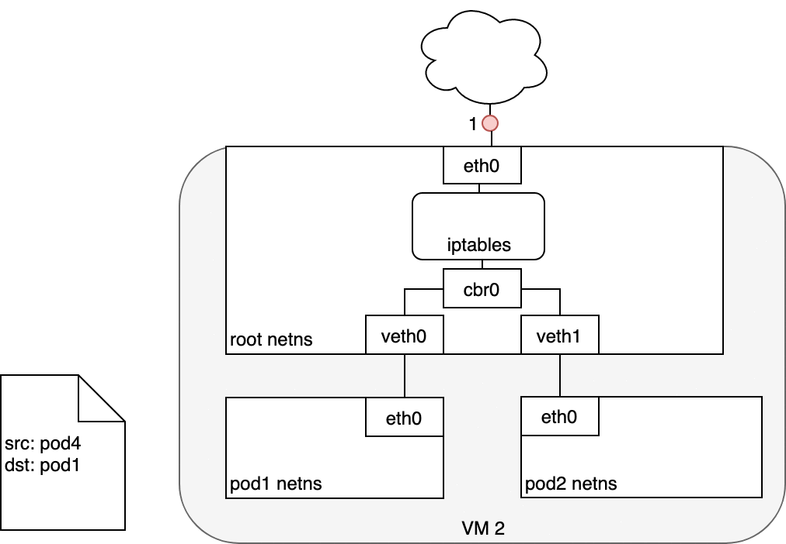
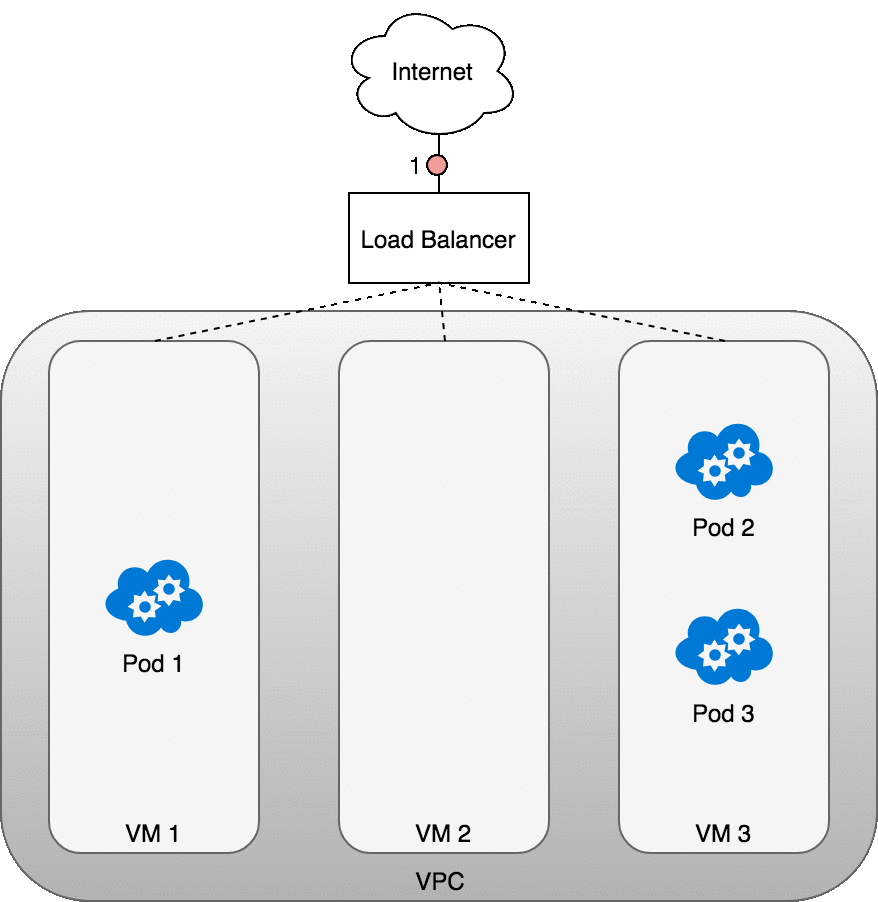
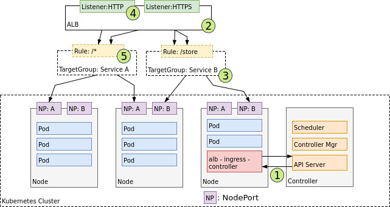

+++
title = "[翻译] Kubernetes 网络模型指南"
date = "2019-10-28T18:55:42+08:00"
draft = false
description = ""
[taxonomies]
tags = ["Kubernetes", "Translation"]
+++

[英文原文](https://sookocheff.com/post/kubernetes/understanding-kubernetes-networking-model/)

Kubernetes 旨在在一组机器上运行分布式系统。分布式系统的本质使网络成为 Kubernetes 部署中的核心且必要的部分，了解 Kubernetes 网络模型将使你能够正确地运行，监控和排查在 Kubernetes 上运行的应用程序。

网络是一个拥有许多成熟技术的广阔领域。对于不那么熟悉这个领域的人来说，这可能会令人感到不适，因为大多数人已经对网络有了先入为主的观念，而在 Kubernetes 中有很多新旧概念需要理解并将它们融合为一个整体。一个粗略的列表可能包括诸如网络命名空间，虚拟接口，IP 转发和网络地址转换之类的技术。本指南旨在通过讨论各种 Kubernetes 依靠的技术以及对这些技术是如何用来实现 Kubernetes 网络模型的描述来讲解 Kubernetes 网络模型。

本指南相当长，分为几个部分。我们首先讨论一些基本的 Kubernetes 术语以确保在整个指南中正确使用术语，然后讨论 Kubernetes 的网络模型以及它规定的设计和实现决策。接下来是本指南中最长且最有趣的部分：通过几种不同的用例深入讨论流量是如何在 Kubernetes 中被路由的。

如果您对一些网络术语，本指南附有网络术语词汇表。

## 目录

* 1 Kubernetes 基础知识
* 2 Kubernetes 网络模型
* 3 Container 到 Container 网络
* 4 Pod 到 Pod 网络
* 5 Pod 到 Service 网络
* 6 Internet 到 Service 网络
* 6.1 Egress
* 6.2 Ingress
* 7 总结
* 8 术语表

## 1 Kubernetes 基础知识

Kubernetes 是由一些核心概念构建而成的，这些核心概念被组合成越来越强大的功能。本节列出了这些概念，并提供了简要概述以帮助促进讨论。Kubernetes 的功能远不止这里列出的内容，本节作为入门使读者可以在后续部分中参考。如果您已经熟悉 Kubernetes，请随意跳过本节。

### 1.1 Kubernetes API 服务器

在 Kubernetes 中，一切都是由 Kubernetes API 服务器 (`kube-apiserver`) 提供的 API 调用。API 服务器是通往维护着应用程序集群的所需状态的 [etcd](https://github.com/coreos/etcd) 数据存储的网关。要更新 Kubernetes 集群的状态，您需要对 API 服务器进行 API 调用以描述所需的状态。

### 1.2 Controllers

Controller 是用于构建 Kubernetes 的核心抽象概念之一。在使用 API 服务器声明集群的期望状态后，Controller 将通过持续监视 API 服务器的状态并对所以变化做出反应来确保集群的当前状态与期望状态相匹配。Controller 使用一个简单的循环进行操作，该循环不断地根据群集当前状态对比群集的期望状态。如果存在任何差异，则控制器执行任务以确保当前状态与期望状态符合。用伪代码来表示：

```
while true:
  X = currentState()
  Y = desiredState()

  if X == Y:
    return  # Do nothing
  else:
    do(tasks to get to Y)
```

例如，当您使用 API 服务器创建新的 Pod 时，`kube-scheduler` (一个 Controller) 会注意到更改，并决定 Pod 部署在群集中的位置。然后，它使用 API 服务器 (由 etcd 支持) 写入状态变更。然后，`kubelet` (另一个 Controller) 会注意到新的更改，并建立所需的网络功能以使 Pod 在群集中可达。在这里，两个不同的控制器对两个不同的状态更改做出反应，以使集群的实际状况与用户的意图相匹配。

### 1.3 Pods

Pod 相当于 Kubernetes 中的原子 - 用于构建应用程序的最小可部署对象。单个 Pod 代表集群中正在运行的工作负载，并封装一个或多个 Docker 容器，任何必需的存储以及一个唯一的 IP 地址。组成 Pod 的容器在设计上是协同的，并在同一机器上进行调度。

### 1.4 Nodes

Node 是运行 Kubernetes 集群的机器。它们可以是裸机，虚拟机或其他东西。主机 (Host) 一词通常与 Node 交替使用。我会尽量使用一致的术语 Node，但有时会根据上下文使用虚拟机 (Virtual Machine) 一词来指代节点。

## 2 Kubernetes 网络模型

Kubernetes 对 Pods 的联网方式做出了固执的选择。特别的，Kubernetes 对所有的网络实现都作出了以下要求：

* 所有 Pod 都可以与所有其他 Pod 通信而无需使用网络地址转换 (NAT)
* 所有 Node 都可以在没有 NAT 的情况下与所有 Pod 通信
* Pod 所见的它的 IP 就是其他 Pod 看到的它的 IP

由于这些约束，我们现在有四个不同的联网问题需要解决：

1. Container 到 Container 网络
2. Pod 到 Pod 网络
3. Pod 到 Service 网络
4. Internet 到 Service 网络

指南剩下的部分将会依次讨论这些问题及其解决方法。

## 3 Container 到 Container 网络

通常，我们将虚拟机中的网络通信视为直接与以太网设备进行交互，如图 1 所示。


图1. 以太网设备的理想状况

在现实中，情况更加微妙。在 Linux，每个运行中的进程通过 [网络命名空间](http://man7.org/linux/man-pages/man8/ip-netns.8.html) 进行通信，网络命名空间拥有它自己的路由规则、防火墙规则和网络设备。本质上，一个网络命名空间为命名空间内的所有进程提供了一个全新的网络栈。

Linux 用户可以用 `ip` 命令创造网络命名空间。例如，下面的命令创建了一个新的网络命名空间 `ns1`。

```
$ ip netns add ns1
```

当命名空间被创建时，它的挂载点 `/var/run/netns` 随之创建。这样即使没有进程归属于它也可以持久化。

你可以通过列出 `/var/run/netns` 挂载点来列出可用的命名空间，或者用 `ip` 命令。

```
$ ls /var/run/netns
ns1
$ ip netns
ns1
```

默认的，Linux 将所有进程分配给 root 网络命名空间来提供外部访问，如图 2。



图2. Root 网络命名空间

对于 Docker 的结构来说，一个 Pod 是一组共享同一网络命名空间的 Docker 容器。同一 Pod 中的容器拥有网络命名空间分配给 Pod 的相同的 IP 地址和端口范围，并且可以通过 localhost 找到各自，因为他们在同一命名空间内。我们为虚拟机中的每一个 Pod 创建网络命名空间。在 Docker 的实现中，一个 "Pod 容器" 打开网络命名空间，然后用户指定的 "app containers" 通过 Docker 的 –net=container: 功能加入这个网络命名空间。图 3 展示了多个容器 (`ctr*`) 组成的 Pod 在共享的命名空间的情景。


图3. 每个 Pod 一个网络命名空间

同一个 Pod 中的应用程序同样拥有共享卷的访问权，根据 Pod 的定义, 共享卷可挂载到每个应用程序的文件系统。

## 4 Pod 到 Pod 网络

在 Kubernetes 中，每个 Pod 都拥有真正的 IP 地址而且可以通过这个 IP 地址与别的 Pod 通信。当前需要理解 Kubernetes 是如何使 Pod 到 Pod 通信通过真正的 IP，无论 Pod 是在同一台物理 Node 上还是集群中的不同 Node 上。我们从假设 Pod 在相同的机器上开始讨论，避免 Node 之间通信在内部网络之外的复杂情况。

对于 Pod 来说，它在其命名空间中尝试去和在同一 Node 上不同网络命名空间通信。幸运的，命名空间可以通过 Linux [Virtual Ethernet Device](http://man7.org/linux/man-pages/man4/veth.4.html)，或通过由两个虚拟接口组成的可以扩展到多个网络命名空间的 `veth pair` 连接。为了连接 Pod 的命名空间，我们可以把 veth pair 的一端连接到 root 网络命名空间，另一端连接到 Pod 的网络命名空间。Veth pair 像跳线一样工作，连接两端使流量可以流通。这一步可以重复直到其数目和机器上的 Pods 一样多。图 4 展示了 veth pair 连接了所有 Pod 到 VM 的 root 命名空间的情况。


图4. 每个 Pod 均有 veth pair

现在，我们建立了有独立网络命名空间的 Pod，让他们相信他们拥有他们自己的以太网设备和 IP 地址，然后他们连接到了 Node 的 root 命名空间上。现在，我们想让 Pod 通过 root 命名空间和彼此通信，为此我们使用网桥。

Linux 以太网网桥是一个用来连接两个或以上网段的虚拟的 2 层网络设备，透明地工作在两个网络上使其相连。网桥维护一个来源和目标的转发表，通过检测经过它的数据包的目的地来决定它是否将数据包传递给别的连接到桥上的网段。网桥码通过查找网络中以太网设备唯一的 MAC 地址来决定了是否桥接数据或将其丢弃。

网桥实现了 ARP 协议来发现链路层 MAC 地址关联的 IP 地址的。当数据帧被网桥接收时，网桥向所有连接的设备 (除了原发送者) 广播帧，响应的设备被存入查询表。之后带有相同 IP 地址的流量将会使用查询表来查找转发的正确 MAC 地址。


图5. 通过网桥连接命名空间

### 4.1 包的生命周期：同一 Node 上 Pod 到 Pod

已有将 Pod 隔离到其网络堆栈的网络名称空间，将每个命名空间连接到 root 命名空间的虚拟以太网设备，和将命名空间连接在一起的网桥，我们终于准备好在同一 Node 上的 Pod 之间发送流量了。图 6 演示了这个过程。


图6. 包在同一个 Node 上 Pod 之间传递

在图 6 中，容器 1 将数据包发送到其自己的以太网设备 `eth0`，该设备作为容器的默认设备。对于 Pod1，`eth0` 通过虚拟以太网设备连接到 root 命名空间 `veth0` (1)。配置网桥 `cbr0` 连接到网段 `veth0`。数据包到达网桥后，网桥使用 ARP 协议将其解析到其正确的目标网段 `veth1` (3)。当数据包到达虚拟设备 `veth1` 时，它将直接被转发到 Pod2 的命名空间和该命名空间中的 `eth0` 设备 (4)。在整个流量流中，每个 Pod 仅与 `localhost` 上的 `eth0` 通信，并且流量被路由到正确的 Pod。对于这个网络的使用，我们的经验是它符合开发人员期望的默认行为。

Kubernetes 的网络模型要求 Pod 必须通过其在跨 Node 中的 IP 地址才能访问。也就是说，一个 Pod 的 IP 地址始终对网络中的其他 Pod 可见，并且每个 Pod 所见的自己的 IP 地址都与其他 Pod 所见一致。现在，我们转向在不同 Node 上的 Pod 之间路由流量的问题。

### 4.2 包的生命周期：不同 Node 上 Pod 到 Pod

在确定了如何在同一 Node 上的 Pod 之间路由数据包之后，我们转向在不同 Node 上的 Pod 之间路由流量。Kubernetes 网络模型要求 Pod IP 在整个网络上可达，但是它没有指定必须如何完成。实际上，这是基于特定于网络的，但是已有一些模式被建立起来以简化此过程。

通常，群集中的每个节点都分配有一个 CIDR 块，该块指定了该 Node 上运行的 Pod 可用的 IP 地址。一旦发往 CIDR 块的流量到达 Node，则 Node 有责任将流量转发到正确的 Pod。图 7 说明了两个 Node 之间的流量流，假设网络可以将 CIDR 块中的流量路由到正确的 Node。


图7. 包在不同 Node 上的 Pod 之间传递

图 7 从与图 6 相同的请求开始，除了目标 Pod (以绿色突出显示) 与源 Pod (以蓝色突出显示) 位于不同的 Node 上。数据包首先通过 Pod1 的以太网设备发送，该设备与 root 命名空间中的虚拟以太网设备配对 (1)。数据包最终到达 root 名称空间的网桥 (2)。ARP 将在网桥上失败，因为没有任何匹配数据包 MAC 地址的设备连接到网桥。网桥在失败时会将数据包送出默认路由 - root 命名空间 `eth0` 设备。此时，路由离开节点并进入网络 (3)。现在我们假设网络可以根据分配给 Node 的 CIDR 块将数据包路由到正确的 Node (4)。数据包进入目标 Node 的 root 命名空间 (VM 2 上的 `eth0`)，然后通过网桥路由到正确的虚拟以太网设备 (5)。最后，通过流经 Pod4 命名空间中的虚拟以太网设备对来完成路由 (6)。一般而言，每个 Node 都知道如何将数据包传递到其中运行的 Pod。数据包到达目标 Node 后，数据包的流动方式与在同一 Node 上的 Pod 之间路由流量的方式相同。

我们省略了一步，即如何配置网络以将 Pod IP 的流量路由到负责这些 IP 的正确的 Node。这是特定于网络的，不过通过研究相关特例也可以提供其所涉及问题的一些见解。例如，对于 AWS，Amazon 为 Kubernetes 维护了一个容器网络插件，该插件通过 [容器网络接口 (CNI) 插件](https://github.com/aws/amazon-vpc-cni-k8s) 使在 Amazon VPC 环境中的 Node 到 Node 网络成为可能。

容器网络接口 (CNI) 提供了用于将容器连接到外部网络的通用 API。作为开发人员，我们想知道 Pod 可以使用 IP 地址与网络通信，并且我们希望此操作的机制透明。由 AWS 开发的 CNI 插件试图满足这些需求，同时通过 AWS 提供的现有 VPC，IAM 和安全组功能提供安全且可管理的环境。解决方案是使用弹性网络接口。

在 EC2 中，每个实例都绑定到一个弹性网络接口 (ENI)，并且所有 ENI 都连接在 VPC 内 - ENI 可以相互访问，而无需付出额外的代价。默认情况下，每个 EC2 实例都部署有一个 ENI，但是您可以随意创建多个 ENI 并将它们部署到您认为合适的 EC2 实例中。用于 Kubernetes 的 AWS CNI 插件利用这种灵活性，为部署到 Node 的每一个 Pod 创建一个新的 ENI。由于 VPC 中的 ENI 已经连接到了现有的 AWS 基础设施，因此，每个在 VPC 中 Pod 的 IP 地址都是本地可寻址的。将 CNI 插件部署到群集后，每个 Node (EC2 实例) 都会创建多个弹性网络接口，并为这些实例分配 IP 地址，从而为每个 Node 形成一个 CIDR 块。部署 Pod 时，作为 DaemonSet 部署到 Kubernetes 集群的小型二进制文件会收到所有的来自 Node 本地 kubelet 进程的将 Pod 添加到网络的请求。该二进制文件从 Node 的可用 ENI 池中选择一个可用 IP 地址，并通过在 Linux 内核中连接虚拟以太网设备和网桥，将其分配给 Pod，如在同一节点内将 Pod 联网时所述。有了这个，Pod 流量就可以在集群中跨 Node 进行路由。

## 5 Pod 到 Service 网络

我们已经展示了如何在 Pod 及其关联的 IP 地址之间路由流量。这非常有效，直到我们需要应对变化。Pod IP 地址不是持久性的，并且会出现和消失，以应对规模扩大和缩小，应用程序的崩溃或节点重新启动。每一个这些事件都可以使 Pod IP 地址更改而不会发出任何警告。内置在 Kubernetes 的 Service 用以解决此问题。

Kubernetes 的 Service 管理一组 Pod 的状态，使您可以跟踪随时动态变化的一组 Pod IP 地址。Service 充当 Pod 的抽象，并为一组 Pod IP 地址分配一个虚拟 IP 地址。寻址到 Service 的虚拟 IP 的任何流量都将被路由到与虚拟 IP 关联的 Pod 集。这允许与 Service 关联的 Pod 集随时更改 - 客户端只需要了解 Service 的不变的虚拟 IP。

创建新的 Kubernetes Service 时，将为您创建一个新的虚拟 IP (也称为群集 IP)。在群集中的任何位置，寻址到虚拟 IP 的流量将负载均衡到与该 Service 关联的一组后端 Pod。实际上，Kubernetes 会自动创建并维护一个集群内的分布式负载均衡器，该负载均衡器会将流量分发到与 Service 相关联的健康 Pod。让我们仔细看看它是如何工作的。

### 5.1 netfilter 和 iptables

为了在群集内执行负载平衡，Kubernetes 依赖于 Linux 内置的网络框架 `netfilter`。Netfilter 是一个 Linux 提供的网络框架，允许通过定制的 handler 来实现一系列网络相关的操作。Netfilter 提供了用于数据包过滤，网络地址转换和端口映射的各种功能和操作，这些功能和操作满足了网络中数据包重定向所需，并提供了禁止数据包到达计算机网络内敏感位置的功能。

Iptables 是一个用户空间程序，它提供一个基于表的系统，用于定义使用 netfilter 框架操作和转换数据包的规则。在 Kubernetes 中，iptables 规则由监视 Kubernetes API 服务器更改的 kube-proxy Controller 配置。当对 Service 或 Pod 的更改更新了 Service 的虚拟 IP 地址或 Pod 的 IP 地址时，将更新 iptables 规则以将针对 Service 的流量正确路由到后端 Pod。Iptables 规则监视发往 Service 的虚拟 IP 的流量，并在匹配项中从可用 Pod 的集合中选择一个随机的 Pod IP 地址，并且 iptables 规则将数据包的目标 IP 地址从服务的虚拟 IP 更改为 选中的 Pod 的 IP。随着 Pod 的规模扩大和缩小，iptables 规则集将更新以反映集群的变化状态。换句话说，iptables 在计算机上已通过将定向到 Service IP 的流量定向到实际 Pod 的 IP 完成了负载均衡，以。

在反过来的路径上，IP 地址来自目标 Pod。在这种情况下，iptables 再次重写 IP 头，用 Servicce 的 IP 替换 Pod 的 IP，使 Pod 认为它一直在与 Service 的 IP 进行通信。

### 5.2 IPVS

Kubernetes 的最新版本 (1.11) 包括集群负载均衡的第二个选项：IPVS。IPVS (IP 虚拟服务器) 也建立在 netfilter 之上，并作为 Linux 内核的一部分实现传输层负载均衡。IPVS 已集成到 LVS (Linux 虚拟服务器) 中，在主机上运行，并充当真实服务器集群前面的负载均衡器。IPVS 可以将基于 TCP 和 UDP 的服务的请求定向到真实服务器，并使由多台服务器组成的服务表现为在单个 IP 地址上的虚拟服务。这使得 IPVS 非常适合 Kubernetes Services。

声明 Kubernetes Service 时，可以指定是否要使用 iptables 或 IPVS 完成集群负载均衡。IPVS 专为负载均衡而设计，并使用更有效的数据结构 (哈希表)，与 iptables 相比，几乎可以无限扩展。创建使用 IPVS 负载均衡的 Service 时，会发生三件事：在 Node 上创建一个虚拟 IPVS 接口，将 Service 的 IP 地址绑定到该虚拟 IPVS 接口，并为每个 Service IP 地址创建 IPVS 服务器。

将来，IPVS 有望成为群集内负载均衡的默认方法。这个更改仅影响群集内负载均衡，在本指南的其余部分中，您可以使用 IPVS 安全地将 iptables 替换为群集内负载平衡，而不会影响其余的讨论。现在，让我们看一下通过群集内负载平衡 Service 的数据包的生命周期。

### 5.3 包的生命周期：Pod 到 Service


图8. 数据包在 Pod 和 Service 间移动

在 Pod 和 Service 之间路由数据包时，旅程以与以前相同的方式开始。数据包首先通过附加到 Pod 网络名称空间 (1) 的 eth0 接口离开 Pod。然后，它通过虚拟以太网设备到达网桥 (2) 。在网桥上运行的 ARP 协议不了解服务，因此它通过默认路由 eth0 (3) 传送数据包。在这里，发生了一些不同的事情。在被 eth0 接受之前，该数据包已通过 iptables 进行过滤。收到数据包后，iptables 会使用 kube-proxy 安装在节点上的规则来响应 Service 或 Pod 事件，将数据包的目标从 Service IP 重写到特定的 Pod IP (4) 。现在，该数据包将到达 Pod 4，而不是服务的虚拟 IP。iptables 充分利用了 Linux 内核的 conntrack 实用程序，以记住做出的 Pod 选择，以便将来的流量被路由到相同的 Pod (除非有任何扩展事件) 。本质上，iptables 直接在节点上完成了集群负载平衡。然后，使用我们已经检查过的 Pod 到 Pod 路由，流量流向 Pod (5)。

### 5.4 包的生命周期：Service 到 Pod


图9. 包在 Service 和 Pod 之间移动

接收到此数据包的 Pod 将做出响应，将源 IP 标识为自己的 IP，将目标 IP 标识为最初发送该数据包的 Pod (1) 。进入节点后，数据包流经 iptables，后者使用 conntrack 记住其先前所做的选择，并将数据包的源重写为服务的 IP，而不是 Pod 的 IP (2) 。数据包从这里流过网桥，到达与 Pod 的命名空间配对的虚拟以太网设备 (3) ，再到我们之前所见的 Pod 的以太网设备 (4) 。

### 5.5 使用 DNS

Kubernetes 可以选择使用 DNS，以避免必须将服务的群集 IP 地址硬编码到您的应用程序中。Kubernetes DNS 作为在群集上计划的常规 Kubernetes 服务运行。它配置在每个节点上运行的 kubelet，以便容器使用 DNS 服务的 IP 来解析 DNS 名称。为群集中定义的每个服务 (包括 DNS 服务器本身) 分配一个 DNS 名称。DNS 记录根据您的需要将 DNS 名称解析为服务的群集 IP 或 POD 的 IP。SRV 记录用于指定运行服务的特定命名端口。

一个 DNS Pod 由三个独立的容器组成：

*   **kubedns**: 监视 Kubernetes 主服务器的服务和端点更改，并维护内存查找结构以服务 DNS 请求。
*   **dnsmasq**: 添加 DNS 缓存以提高性能。
*   **sidecar**: 提供单个运行状况检查端点，以执行 dnsmasq 和 kubedns 的运行状况检查。

DNS Pod 本身作为 Kubernetes 服务公开，具有静态群集 IP，该 IP 在启动时传递给每个正在运行的容器，以便每个容器都可以解析 DNS 条目。DNS 条目通过 kubedns 系统解析，该系统在内存中维护 DNS 表示形式。etcd 是用于群集状态的后端存储系统，而 kubedns 使用一个库，该库在必要时将 etcd 密钥值存储转换为 DNS 条目，以重建内存 DNS 查找结构的状态。

CoreDNS 的工作方式与 kubedns 相似，但其使用的插件体系结构使其更加灵活。从 Kubernetes 1.11 开始，CoreDNS 是 Kubernetes 的默认 DNS 实现。

## 6 从 Internet 到 Service 的网络

到目前为止，我们已经研究了如何在 Kubernetes 集群中路由流量。这一切都很好，但是不幸的是，将您的应用程序与外界隔离将无助于实现任何销售目标——在某个时候，您将需要向外部流量公开您的服务。这种需求突出了两个相关的问题： (1) 将来自 Kubernetes 服务的流量发送到 Internet (Egress) ，以及 (2) 将来自 Internet 的流量发送到您的 Kubernetes Service (Ingress) 。本节依次阐述这些问题。

### 6.1 Egress — 将流量路由到 Internet

从节点到公共 Internet 的流量路由是特定于网络的，并且实际上取决于网络配置为发布流量的方式。为了使本节更具体，我将使用 AWS VPC 讨论任何特定细节。

在 AWS 中，Kubernetes 集群在 VPC 内运行，其中为每个节点分配了一个私有 IP 地址，该地址可从 Kubernetes 集群内访问。要使流量可以从群集外部访问，请将 Internet 网关连接到 VPC。Internet 网关有两个目的：在 VPC 路由表中为可路由到 Internet 的流量提供目标，并为已分配了公共 IP 地址的任何实例执行网络地址转换 (NAT) 。NAT 转换负责将群集专用的节点内部 IP 地址更改为公用 Internet 上可用的外部 IP 地址。

有了 Internet 网关后，VM 可以自由地将流量路由到 Internet。不幸的是，这里有一个小问题。Pod 拥有自己的 IP 地址，该 IP 地址与托管 Pod 的节点的 IP 地址不同，并且 Internet 网关上的 NAT 转换仅适用于 VM IP 地址，因为它不了解哪些 Pod 在哪些 VM 上运行——网关不感知容器。让我们看看 Kubernetes 如何使用 iptables (再次) 解决这个问题。

#### 6.1.1 包的生命周期：Node 到 Internet


图10. 将数据包从 Pod 路由到 Internet

在下图中，数据包起源于 Pod 的名称空间 (1) ，并经过与根名称空间 (2) 连接的 veth 对。一旦进入根名称空间，由于数据包上的 IP 与连接到网桥的任何网段都不匹配，数据包就会从网桥移动到默认设备。在到达根名称空间的以太网设备 (3) 之前，iptables 会处理数据包 (3) 。在这种情况下，数据包的源 IP 地址是 Pod，如果我们将源保留为 Pod，则 Internet 网关将拒绝它，因为网关 NAT 仅了解连接到 VM 的 IP 地址。解决方案是让 iptables 执行源 NAT (更改数据包源) ，以便数据包看起来是来自 VM 而不是 Pod。有了正确的源 IP，数据包现在可以离开 VM (4) 并到达 Internet 网关 (5) 。Internet 网关将执行另一个 NAT，将源 IP 从 VM 内部 IP 重写为外部 IP。最终，数据包将到达公共 Internet (6) 。在返回的过程中，数据包遵循相同的路径，并且所有源 IP 处理都被撤消，因此系统的每一层都接收其能够理解的 IP 地址：节点或 VM 级别的 VM 内部 IP，以及 Pod 命名空间内的 Pod IP。

### 6.2 Ingress — 将 Internet 流量路由到 Kubernetes

Ingress——将流量引入群集——是一个非常棘手的问题。同样，这是特定于您正在运行的网络的，但是通常，Ingress 分为两个可在网络堆栈的不同部分上运行的解决方案： (1) Service LoadBalancer 和 (2) Ingress 控制器。

#### 6.2.1 4层 Ingress: LoadBalancer

创建 Kubernetes 服务时，可以选择指定一个 `LoadBalancer` 来配合它。云控制器提供了 `LoadBalancer` 的实现，该控制器知道如何为您的服务创建负载均衡器。创建服务后，它将为负载均衡器通告 IP 地址。作为最终用户，您可以开始将流量定向到负载平衡器，以开始与服务进行通信。

借助 AWS，负载均衡器可以知道其目标组中的节点，并将平衡群集中所有节点上的流量。一旦流量到达节点，先前在整个群集中为您的服务安装的 iptables 规则将确保流量到达您感兴趣的服务的 Pod。

#### 6.2.2 包的生命周期：LoadBalancer 到 Service



图11. 从 Internet 发送到 Service 的数据包

让我们看看这在实践中是如何工作的。部署服务后，您正在使用的云提供商将为您创建一个新的负载均衡器 (1) 。因为负载平衡器不感知容器，所以一旦流量到达负载平衡器，它便会分布在组成群集的所有 VM 中 (2) 。每个 VM 上的 iptables 规则会将来自负载均衡器的传入流量定向到正确的 Pod (3) ——这些规则与创建服务期间制定的 IP 表规则相同，前面已经讨论过。从 Pod 到客户端的响应将返回 Pod 的 IP，但客户端需要具有负载均衡器的 IP 地址。如前所述，iptables 和 conntrack 用于在返回路径上正确重写 IP。

下图显示了在承载 Pod 的三个 VM 之前的网络负载平衡器。传入流量 (1) 指向服务的负载平衡器。一旦负载均衡器收到数据包 (2) ，它就会随机选择一个 VM。在这种情况下，我们病理地选择了没有运行 Pod 的 VM：VM 2 (3) 。在这里，在 VM 上运行的 iptables 规则将使用通过 kube-proxy 安装到群集中的内部负载平衡规则将数据包定向到正确的 Pod。iptables 执行正确的 NAT，并将数据包转发到正确的 Pod (4) 。

#### 6.2.3 7层 Ingress: Ingress Controller

7 层网络 Ingress 在网络堆栈的 HTTP/HTTPS 协议范围内运行，并建立在服务之上。启用 Ingress 的第一步是使用 Kubernetes 中的 `NodePort` 服务类型在服务上打开端口。如果将服务的 `type` 字段设置为 `NodePort`，则 Kubernetes 主服务器将在您指定的范围内分配一个端口，并且每个节点会将该端口 (每个节点上的相同端口号) 代理到您的服务中。也就是说，使用 iptables 规则，任何定向到该节点端口的流量都将转发到该服务。这种从 Service 到 Pod 的路由遵循了我们之前在讨论从 Service 到 Pod 的流量路由时已经讨论过的相同的内部集群负载平衡模式。

要将节点的端口暴露给 Internet，请使用 `Ingress` 对象。Ingress 是更高级别的 HTTP 负载平衡器，可将 HTTP 请求映射到 Kubernetes Services。Ingress 方法将有所不同，具体取决于 Kubernetes 云提供商控制器如何实现它。HTTP 负载平衡器 (如 4 层网络负载平衡器) 仅了解 Node IP (而非 Pod IP) ，因此流量路由同样利用 kube-proxy 在每个节点上安装的 iptables 规则提供的内部负载平衡。

在 AWS 环境中，ALB Ingress Controller 使用 Amazon 的 7 层应用程序负载平衡器 (ALB) 提供 Kubernetes Ingress。下图详细说明了此控制器创建的 AWS 组件。它还演示了 Ingress 流量从 ALB 到 Kubernetes 集群的路由。



图12. Ingress Controller 的设计

创建后， (1) Ingress Controller 将监视来自 Kubernetes API 服务器的 Ingress 事件。当发现满足其要求的 Ingress 资源时，它将开始创建 AWS 资源。AWS 将应用程序负载平衡器 (ALB)  (2) 用于 Ingress 资源。负载均衡器与用于将请求路由到一个或多个已注册节点的目标组 (Target Groups) 配合使用。(3) 在 AWS 中为 Ingress 资源描述的每个唯一的 Kubernetes 服务创建目标组。(4) 侦听器 (Listener) 是 ALB 进程，它使用您配置的协议和端口检查连接请求。Ingress 控制器为 Ingress 资源注释中详细说明的每个端口创建侦听器。最后，为 Ingress 资源中指定的每个路径创建目标组规则。这样可以确保将到特定路径的流量路由到正确的 Kubernetes 服务 (5) 。

#### 6.2.4 包的生命周期：Ingress 到 Service


图13. 从 Ingress 发送到 Service 的数据包

流经 Ingress 的数据包的生命周期与 LoadBalancer 的非常相似。主要区别在于，Ingress 知道 URL 的路径 (允许并可以根据服务的路径将流量路由到服务) ，并且 Ingress 和 Node 之间的初始连接是通过为每个服务在 Node 上暴露的端口进行的。

让我们看看这在实践中是如何工作的。部署服务后，您正在使用的云提供商将为您创建一个新的 Ingress 负载均衡器 (1) 。由于负载平衡器不感知容器，因此，一旦流量到达负载平衡器，它将通过为您的服务通告的端口在组成您的群集 (2) 的所有 VM 中进行分配。如前所述，每个 VM 上的 iptables 规则会将来自负载均衡器的传入流量定向到正确的 Pod (3) 。从 Pod 到客户端的响应将返回 Pod 的 IP，但客户端需要具有负载均衡器的 IP 地址。如前所述，iptables 和 conntrack 用于在返回路径上正确重写 IP。

7 层负载平衡器的一个好处是它们可以识别 HTTP，因此他们知道 URL 和路径。这使您可以按 URL 路径细分服务流量。它们通常还会在 HTTP 请求的 `X-Forwarded-For` 标头中提供原始客户端的 IP 地址。

## 7 总结

本指南为理解 Kubernetes 网络模型及其如何实现常见的网络任务提供了基础。网络领域既广且深，不可能在这里涵盖所有内容。本指南应为您提供一个起点，以深入研究您感兴趣并希望了解更多的主题。每当您遇到困难时，请利用 Kubernetes 文档和 Kubernetes 社区来帮助您找到方向。

### 8 术语表

Kubernetes 依靠几种现有技术来构建可运行的集群。全面探索每种技术不在本指南的讨论范围内，但是本节将对每种技术进行足够详细的介绍，以供讨论时参考。您可以随意浏览本节，完全跳过本节，或者在感到困惑或需要复习时根据需要参考。

### 2层网络 (Layer 2 Networking)
第 2 层是提供节点到节点数据传输的数据链路层。它定义了在两个物理连接的设备之间建立和终止连接的协议，以及它们之间的流量控制协议。

### 4层网络 (Layer 4 Networking)
传输层通过流量控制来控制给定链接的可靠性。在 TCP/IP 中，该层指的是用于在不可靠网络上交换数据的 TCP 协议。

### 7层网络 (Layer 7 Networking)
应用层是离最终用户最近的层，这意味着应用层和用户都直接与软件应用程序交互。该层与实现通信组件的软件应用程序交互。通常，7 层网络指的是 HTTP。

### NAT — 网络地址转换 (Network Address Translation)
NAT 或网络地址转换是将一个地址空间 IP 级别地重新映射到另一个地址空间。该映射通过在数据包在流量路由设备中传输时修改其 IP 头中的网络地址信息来实现。

基本的 NAT 是从一个 IP 地址到另一个 IP 地址的简单映射。更常见的是，NAT 用于将多个私有 IP 地址映射到一个公共暴露的 IP 地址。通常，本地网络使用私有 IP 地址空间，该网络上的路由器在该空间中被赋予一个私有地址。然后，该路由器通过一个公共 IP 地址连接到 Internet。当流量从本地网络传递到 Internet 时，每个数据包的源地址从私有地址转换为公共地址，使其看起来好像请求直接来自路由器。路由器维护连接跟踪，以将回复转发到本地网络上正确的私有 IP。

NAT 提供了一个额外的好处，即允许大型私有网络使用单个公共 IP 地址连接到 Internet，从而节省了公共使用的 IP 地址数量。

### SNAT — 源网络地址转换 (Source Network Address Translation)
SNAT 仅指修改 IP 数据包源地址的 NAT 过程。这是上述 NAT 的典型行为。

### DNAT — 目的网络地址转换 (Destination Network Address Translation)
DNAT 指修改 IP 数据包目的地址的 NAT 过程。DNAT 用于将位于私有网络中的服务发布到可公开寻址的 IP 地址。

### 网络命名空间 (Network Namespace)
在网络中，每台机器 (真实的或虚拟的) 都有一个以太网设备 (我们称之为 eth0) 。所有进出机器的流量都与该设备相关联。实际上，Linux 将每个以太网设备与一个网络命名空间相关联——这是整个网络堆栈的逻辑副本，拥有自己的路由、防火墙规则和网络设备。最初，所有进程都从 init 进程共享相同的默认网络命名空间，称为根命名空间。默认情况下，进程从其父进程继承其网络命名空间，因此，如果您不做任何更改，所有网络流量都将通过为根网络命名空间指定的以太网设备流动。

### veth — 虚拟以太网设备对 (Virtual Ethernet Device Pairs)
计算机系统通常由一个或多个网络设备 (eth0，eth1 等) 组成，这些设备与负责将数据包放置到物理线路上的物理网络适配器相关联。Veth 设备是始终以互连对形式创建的虚拟网络设备。它们可以充当网络命名空间之间的隧道，以创建到另一个命名空间中物理网络设备的桥梁，但也可以用作独立的网络设备。您可以将 veth 设备视为设备之间的虚拟跳线——一端进去的东西会从另一端出来。

### bridge — 网络网桥 (Network Bridge)
网络网桥是一种从多个通信网络或网段创建单个聚合网络的设备。桥接将两个独立的网络连接起来，就好像它们是一个单一的网络一样。桥接使用内部数据结构来记录每个数据包发送到的位置，作为性能优化。

### CIDR — 无类别域间路由 (Classless Inter-Domain Routing)
CIDR 是一种分配 IP 地址和执行 IP 路由的方法。使用 CIDR，IP 地址由两组组成：网络前缀 (标识整个网络或子网) 和主机标识符 (指定该网络或子网上主机的特定接口) 。CIDR 使用 CIDR 表示法表示 IP 地址，其中地址或路由前缀带有一个后缀，指示前缀的位数，例如 IPv4 的 192.0.2.0/24。IP 地址是 CIDR 块的一部分，如果地址的初始 n 位与 CIDR 前缀相同，则称其属于该 CIDR 块。

### CNI — 容器网络接口 (Container Network Interface)
CNI (容器网络接口) 是云原生计算基金会 (Cloud Native Computing Foundation) 的一个项目，由一个规范和用于编写插件以在 Linux 容器中配置网络接口的库组成。CNI 只关心容器的网络连接性以及在容器被删除时移除已分配的资源。

### VIP — 虚拟 IP 地址 (Virtual IP Address)
虚拟 IP 地址 (VIP) 是一种软件定义的 IP 地址，不对应于实际的物理网络接口。

### netfilter — Linux 的包过滤框架
netfilter 是 Linux 中的数据包过滤框架。实现此框架的软件负责数据包过滤、网络地址转换 (NAT) 和其他数据包处理。

netfilter、ip_tables、连接跟踪 (ip_conntrack, nf_conntrack) 和 NAT 子系统共同构成了该框架的主要部分。

### iptables — 包处理工具
iptables 是一个允许 Linux 系统管理员配置 netfilter 及其存储的链和规则的程序。IP 表中的每个规则都由多个分类器 (iptables 匹配) 和一个连接的动作 (iptables 目标) 组成。

### conntrack — 连接跟踪
conntrack 是建立在 Netfilter 框架之上的用于处理连接跟踪的工具。连接跟踪允许内核跟踪所有逻辑网络连接或会话，并将每个连接或会话的数据包定向到正确的发送方或接收方。NAT 依赖此信息以相同的方式转换所有相关数据包，而 iptables 可以使用此信息充当有状态的防火墙。

### IPVS — IP 虚拟服务器 (IP Virtual Server)
IPVS 作为 Linux 内核的一部分实现传输层负载均衡。

IPVS 是一个类似于 iptables 的工具。它基于 Linux 内核的 netfilter 钩子函数，但使用哈希表作为底层数据结构。这意味着，与 iptables 相比，IPVS 重定向流量的速度要快得多，在同步代理规则时性能要好得多，并提供更多的负载均衡算法。

### DNS — 域名系统 (The Domain Name System)
域名系统 (DNS) 是一种用于将系统名称与 IP 地址关联的分散式命名系统。它将域名转换为数字 IP 地址，以便定位计算机服务。
