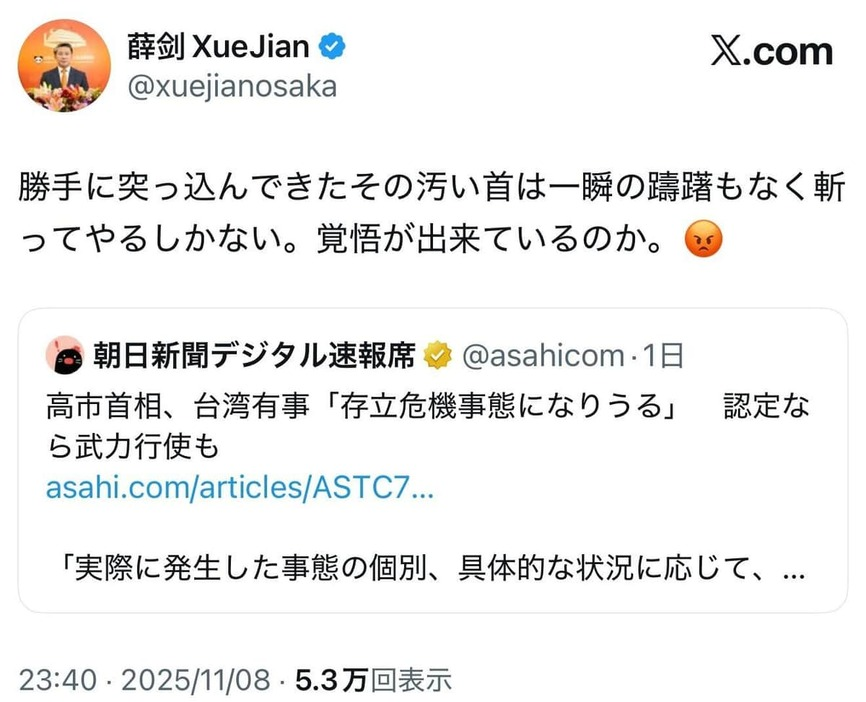

+++
title = "Fake News 的一件小事"
date = "2025-11-13T15:08:27+09:00"
updated = "2025-11-13T18:20:27+09:00"
draft = false
description = ""
[taxonomies]
tags = ["History", "Commentary"]
+++

最近, 中华人民共和国驻大阪总领事薛剑在 X 上的言论引起了一些争议, 具体的言论如图:

具体的日文原文如下:
> 勝手に突っ込んできたその汚い首は一瞬の躊躇もなく斬ってやるしかない。覚悟が出来ているのか。

其回应的推特原文如下:
> 高市首相、台湾有事「存立危機事態になりうる」　認定なら武力行使も
> https://www.asahi.com/articles/ASTC722TVTC7UQIP04NM.html
> 「実際に発生した事態の個別、具体的な状況に応じて、政府がすべての情報を総合して判断する。武力攻撃が発生したら、これは存立危機事態にあたる可能性が高い」とも語りました。

`FOX NEWS` 在新闻页面上给出的英文翻译如下:
> That filthy neck that barged in on its own. I've got no choice but to cut if off without a moment's hesitation. Are you prepared for that?

在与特朗普的专访对谈中, 劳拉·英格拉哈姆, 美国一位广播脱口秀主持人, 畅销书作家和保守派政论家, 这样描述这段发言:

> Laura Ingraham: And over the weekend, the new Japanese prime minister, who I know you like a lot, Takaichi, called the Taiwan situation extremely severe in its phase and that they may consider any move on Taiwan by China to be a national survival crisis for Japan. Now that gets better. A Chinese diplomat today said in a social media post that, she the prime minister of Japan, should be beheaded for her comments.

而特朗普做出的回应如下:

> President Donald Trump: Well, a lot of our allies aren't our friends either. Our allies took advantage of us on trade more than China did. And China took big advantage. We built their military. We built their whole thing.

从这个事件, 可以清晰的看到 Fake News 是如何产生的. 在节目中为了构建中国官方**野蛮暴力**的形象, 达到**耸人听闻**的效果, 将原本的**激烈言辞**转化成了更**直接**, 更**具体**, 更具**爆炸性**的对日本首相的**人身威胁**, 甚至可以当面**诱导**美国总统.

这位美国总统多次表明过, **不准确**, **偏见**, **断章取义**的新闻报道是 **Fake News**, 也算是身经百战见得多了, 没有具体事情上做评论, 而是谈起来日本并不是美国的朋友, 转回他熟悉的对盟友在经贸问题上占便宜的叙事框架, 场面一度略显尴尬.

## 参考资料
* [Trump pulls back curtain on relationship with Xi Jinping](https://www.youtube.com/watch?v=7juiv6qrYds)
* [高市首相、台湾有事「存立危機事態になりうる」　武力攻撃の発生時](https://www.asahi.com/articles/ASTC722TVTC7UQIP04NM.html)
* [高市首相、台湾有事「存立危機事態になりうる」　認定なら武力行使も](https://x.com/asahicom/status/1986702380969144741)
