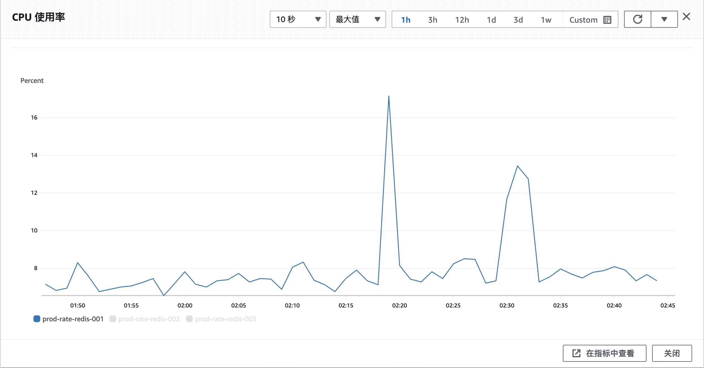
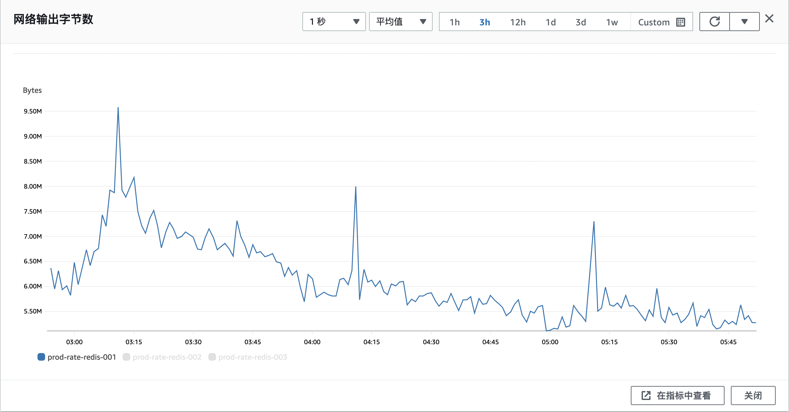

+++
title = "Redis 查询偶尔超时问题排查"
date = "2022-10-28T14:54:14+09:00"
draft = false
description = ""
[taxonomies]
tags = ["Redis", "Database"]
+++

## 表现
业务上 Redis 做去重使用, 量大但是操作简单, 超时均设置为 10ms, 偶尔有超时情况报错, 超时错误分布与业务流量正相关. Redis 由 `AWS` 的 `ElasticCache` 服务提供. 其中典型操作如下
```
SET key value expiration
GET key
MGET key1 key2 ...
```
## Redis 客户端测试数据
### latency-history
`Redis` 的 `latency-history` 选项将 `PING` 命令发送到 `Redis` 实例, 并测量响应时间, 统计时间以毫秒为单位.
```
# date
Fri Oct 28 10:49:58 JST 2022
# redis-cli -h {host} -p {port} --latency-history -i 5
min: 1, max: 5, avg: 1.92 (418 samples) -- 5.00 seconds range
min: 1, max: 5, avg: 1.93 (418 samples) -- 5.01 seconds range
min: 1, max: 5, avg: 1.93 (417 samples) -- 5.00 seconds range
min: 1, max: 7, avg: 1.98 (416 samples) -- 5.01 seconds range
min: 1, max: 4, avg: 1.94 (417 samples) -- 5.00 seconds range
min: 1, max: 3, avg: 1.93 (418 samples) -- 5.01 seconds range
min: 1, max: 3, avg: 1.92 (418 samples) -- 5.00 seconds range
min: 1, max: 3, avg: 1.94 (418 samples) -- 5.01 seconds range
min: 1, max: 3, avg: 1.95 (418 samples) -- 5.01 seconds range
min: 1, max: 17, avg: 2.08 (412 samples) -- 5.01 seconds range
min: 1, max: 5, avg: 2.00 (416 samples) -- 5.01 seconds range
min: 1, max: 4, avg: 1.94 (417 samples) -- 5.00 seconds range
min: 1, max: 5, avg: 1.89 (418 samples) -- 5.01 seconds range
min: 1, max: 3, avg: 1.91 (418 samples) -- 5.01 seconds range
min: 1, max: 13, avg: 2.01 (415 samples) -- 5.01 seconds range
min: 1, max: 12, avg: 2.12 (411 samples) -- 5.01 seconds range
min: 1, max: 5, avg: 1.96 (416 samples) -- 5.00 seconds range
min: 1, max: 8, avg: 2.07 (413 samples) -- 5.01 seconds range
min: 1, max: 7, avg: 1.97 (415 samples) -- 5.00 seconds range
min: 1, max: 5, avg: 1.93 (417 samples) -- 5.00 seconds range
min: 1, max: 8, avg: 1.99 (416 samples) -- 5.01 seconds range
min: 1, max: 6, avg: 2.04 (413 samples) -- 5.00 seconds range
min: 1, max: 3, avg: 2.03 (79 samples)^C
# date
Fri Oct 28 10:52:16 JST 2022
```
可以看到, 对于 `PING` 这样可以说没有任何性能负担的命令, 依然有少数情况响应时间大于 10ms
### 使用 benchmark 测试简单操作
```
# redis-benchmark -h {host} -t set,get -c 50 -d 64
====== SET ======
  100000 requests completed in 4.51 seconds
  50 parallel clients
  64 bytes payload
  keep alive: 1

0.00% <= 1 milliseconds
20.53% <= 2 milliseconds
95.87% <= 3 milliseconds
98.53% <= 4 milliseconds
99.24% <= 5 milliseconds
99.72% <= 6 milliseconds
99.75% <= 7 milliseconds
99.75% <= 8 milliseconds
99.76% <= 9 milliseconds
99.80% <= 10 milliseconds
99.85% <= 11 milliseconds
99.92% <= 12 milliseconds
99.98% <= 13 milliseconds
100.00% <= 13 milliseconds
22187.71 requests per second

====== GET ======
  100000 requests completed in 5.78 seconds
  50 parallel clients
  64 bytes payload
  keep alive: 1

0.00% <= 1 milliseconds
6.49% <= 2 milliseconds
76.89% <= 3 milliseconds
89.58% <= 4 milliseconds
94.31% <= 5 milliseconds
96.33% <= 6 milliseconds
97.64% <= 7 milliseconds
98.36% <= 8 milliseconds
98.77% <= 9 milliseconds
99.01% <= 10 milliseconds
99.22% <= 11 milliseconds
99.39% <= 12 milliseconds
99.51% <= 13 milliseconds
99.64% <= 14 milliseconds
99.67% <= 15 milliseconds
99.77% <= 16 milliseconds
99.81% <= 17 milliseconds
99.84% <= 18 milliseconds
99.86% <= 19 milliseconds
99.90% <= 20 milliseconds
99.91% <= 21 milliseconds
99.93% <= 22 milliseconds
99.94% <= 23 milliseconds
99.95% <= 24 milliseconds
99.95% <= 36 milliseconds
99.96% <= 37 milliseconds
99.97% <= 38 milliseconds
99.98% <= 39 milliseconds
99.99% <= 40 milliseconds
99.99% <= 41 milliseconds
100.00% <= 42 milliseconds
100.00% <= 42 milliseconds
17310.02 requests per second

# date
Fri Oct 28 11:20:23 JST 2022
```
对于简单操作的情况, 两个 9 的数据可以在 10ms 以内, 但是性能仍然不对, 预期操作在毫秒以内才是 `Redis` 正常的表现.
### 使用 bigkeys 检查 Key 情况
```
# redis-cli -h {host} --bigkeys

# Scanning the entire keyspace to find biggest keys as well as
# average sizes per key type.  You can use -i 0.1 to sleep 0.1 sec
# per 100 SCAN commands (not usually needed).

[00.00%] Biggest string found so far 'aaaaaaaaaaaaaaaaaaaaaaaaaaaaaaaaaaaaaaaaaaaaaaaaaaaaaaaaa' with 1 bytes
[00.00%] Biggest string found so far 'aaaaaaaaaaaaaaaaaaa' with 644 bytes
[00.00%] Biggest string found so far 'aaaaaaaaaaaaaaaaaaa' with 664 bytes
[00.05%] Biggest string found so far 'aaaaaaaaaaaaaaaaaaaa' with 668 bytes
[00.29%] Biggest string found so far 'aaaaaaaaaaaaaaaaaaaaaaaaaaaaaaaaaaaaaa' with 1312 bytes

-------- summary -------

Sampled 269241 keys in the keyspace!
Total key length in bytes is 11026631 (avg len 40.95)

Biggest string found 'aaaaaaaaaaaaaaaaaaaaaaaaaaaaaaaaaaaaaa' has 1312 bytes

0 lists with 0 items (00.00% of keys, avg size 0.00)
0 hashs with 0 fields (00.00% of keys, avg size 0.00)
269241 strings with 45265771 bytes (100.00% of keys, avg size 168.12)
0 streams with 0 entries (00.00% of keys, avg size 0.00)
0 sets with 0 members (00.00% of keys, avg size 0.00)
0 zsets with 0 members (00.00% of keys, avg size 0.00)

# date
Fri Oct 28 11:33:23 JST 2022
```
Key 整体分布均匀, 没有特别大的 Key 的情况.
## 亚马逊实例数据
### slowlog 典型案例
来自Redis 的 `SLOWLOG` 命令脱敏处理
```
{
    "CacheClusterId": "prod-rate-redis-001",
    "CacheNodeId": "0001",
    "Id": 592,
    "Timestamp": 1666749122,
    "Duration (us)": 18331,
    "Command": "get ... (1 more arguments)",
    "ClientAddress": "172.22.20.210:46370"
}
```
### 客户端测试时 CPU 指标


两个高峰分别是 `benchmark` 和 `bigkey` 操作引起.
### 网络指标


可以看到, `Redis` 网络数据速度每隔一小时会有一个突增.
## 分析
`Redis` 实例是有问题的, 简单操作耗时不能在 1ms 内返回, 99 分位在 10ms, 明显不是一个内存型数据库应有的性能.

由于在性能指标上一直看到 `Redis` 的 CPU 使用率不高, 导致了错误的排查方向, 以为是我们在使用上有问题. 实际上, 问题出在 `aws` 的实例上.

`aws` 的 t2 的实例以 20% 为性能基准, 低于 20% 累计积分, 其中积分累计有上限; 超过 20% 减少积分直至耗尽; 积分是以小时为单位积累的. 虽然没有具体的说明, 实际上 t2 实例的网络带宽也是有相应的积分限制的, 所以体现在网络指标上, 每隔一个小时出现一个特别的波峰.

另外, `aws` 标注的 t2 实例的网络性能是 `Low to Moderate`, 虽然没有官方的解释, 但是根据网友的测试, 基本上是 50Mbps 到 300Mbps. 这也解释了为何网络指标上一直在 6MB/s 左右上下浮动.
## 结论
使用了 `aws` 提供的 `t2.small` 实例, 在 CPU 性能, 网络性能上均有限制, 导致 `Redis` 实例出现超时的情况. 需要提高 `Redis` 实例的配置, 或者使用自建 `Redis`.

谨慎使用 `aws` 的实例类型; 在性能敏感的情况下, 不要使用 `aws` 的 t 类型实例, 一方面是有性能的积分的限制, 另一方面, 也容易碰到 [Noisy Neighbor](https://learn.microsoft.com/en-us/azure/architecture/antipatterns/noisy-neighbor/noisy-neighbor) 的问题.
## 参考文档
* [Diagnosing latency issues](https://redis.io/docs/reference/optimization/latency/)
* [Redis 为什么变慢了？一文讲透如何排查 Redis 性能问题 | 万字长文](https://xie.infoq.cn/article/fbd51c19883ddc1ae19fbc96b)
* [分析网络超时问题的最佳实践](https://developer.aliyun.com/article/702247)
* [Troubleshooting](https://docs.aws.amazon.com/AmazonElastiCache/latest/red-ug/TroubleshootingConnections.html)
* [Troubleshoot Azure Cache for Redis latency and timeouts](https://learn.microsoft.com/en-us/azure/azure-cache-for-redis/cache-troubleshoot-timeouts)
* [Amazon EC2 实例类型](https://aws.amazon.com/cn/ec2/instance-types/)
* [What does amazon aws mean by "network performance"?](https://stackoverflow.com/questions/20663619/what-does-amazon-aws-mean-by-network-performance)
* [What does 'Low to Moderate' network peformance for an ElastiCache Node Type actually mean?](https://www.reddit.com/r/aws/comments/d35sz9/what_does_low_to_moderate_network_peformance_for/)
* [Amazon EC2 实例类型#具爆发能力的实例](https://aws.amazon.com/cn/ec2/instance-types/#Burstable_Performance_Instances)
## 附件
qa 环境下自建 Redis 性能测试
```
# redis-cli -h {host} -p 6379 --latency-history -i 5
min: 0, max: 3, avg: 0.34 (482 samples) -- 5.00 seconds range
min: 0, max: 1, avg: 0.33 (482 samples) -- 5.01 seconds range
min: 0, max: 1, avg: 0.32 (481 samples) -- 5.00 seconds range
min: 0, max: 3, avg: 0.33 (481 samples) -- 5.01 seconds range
min: 0, max: 4, avg: 0.32 (482 samples) -- 5.01 seconds range
min: 0, max: 3, avg: 0.31 (483 samples) -- 5.01 seconds range
min: 0, max: 1, avg: 0.30 (483 samples) -- 5.01 seconds range
min: 0, max: 1, avg: 0.29 (483 samples) -- 5.01 seconds range
min: 0, max: 1, avg: 0.31 (481 samples) -- 5.00 seconds range
min: 0, max: 1, avg: 0.32 (481 samples) -- 5.00 seconds range
min: 0, max: 1, avg: 0.28 (25 samples)^C
# date
Mon Oct 31 18:47:05 JST 2022
```
```
# redis-benchmark -h {host} -t set,get -c 50 -d 64
====== SET ======
  100000 requests completed in 1.36 seconds
  50 parallel clients
  64 bytes payload
  keep alive: 1

99.88% <= 1 milliseconds
99.97% <= 2 milliseconds
99.99% <= 4 milliseconds
100.00% <= 5 milliseconds
100.00% <= 5 milliseconds
73313.78 requests per second

====== GET ======
  100000 requests completed in 1.30 seconds
  50 parallel clients
  64 bytes payload
  keep alive: 1

99.90% <= 1 milliseconds
99.94% <= 2 milliseconds
99.95% <= 4 milliseconds
99.96% <= 5 milliseconds
100.00% <= 5 milliseconds
76628.36 requests per second


# date
Mon Oct 31 18:48:10 JST 2022
```
99分位 10ms -> 999分位 1ms

不过自建 `Redis`, 由于是在 `EC2` 上的托管 Kubernetes 集群, 也需要注意 [Noisy Neighbor](https://learn.microsoft.com/en-us/azure/architecture/antipatterns/noisy-neighbor/noisy-neighbor) 的问题.
## Redis 常见问题排查思路
除了本次遇到的实例性能限制问题, 排查 `Redis` 延迟问题时, 通常还可以从以下几个常见方面入手
### 连接池问题
Redis 配置连接池的重要参数 `MaxIdleOpen`, `IdleCloseTimeout`, 配置不当时, 查看端口占用会有大量 `TIME_WAIT`, `TCP` 的断开会有 2[MSL](https://stackoverflow.com/questions/289194/what-is-maximum-segment-lifetime-msl-in-tcp) - MSL 在 Linux 默认 60s; 适当配置 keep-alive

### Big Key
单个 Key 内容过大, 单线程特性, 可能阻塞整个服务
### 耗时操作
O(N)操作, `KEYS`, `SORT`, `LINDEX`
### 同时超时
超时淘汰方式 - lazy, active, 大量 (25%以上) Key 同时超时, 缓存预热, 超时增加随机因子
## Redis Fun Fact
* Redis 没有"读写"的区别
* [Redis LRU 的近似实现](http://antirez.com/news/109)
* ziplist, 紧凑的内存布局, 用于优化存储小数据量的 `list`, `hash`, `zset`
